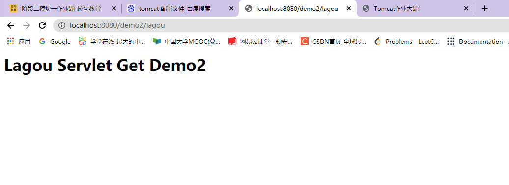
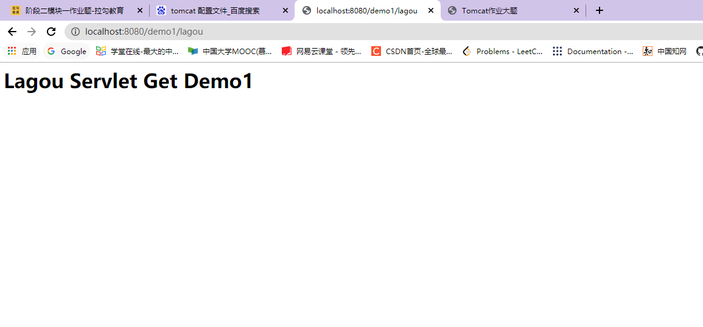

# Tomcat深度剖析及性能调优、Nginx深度剖析及性能调优> 【作业】阶段二模块一作业题

### 题目分析

开发Minicat V4.0，在已有Minicat基础上进⼀步扩展，模拟出webapps部署效果 磁盘上放置⼀个webapps⽬录，webapps中可以有多个项⽬，⽐如demo1,demo2,demo3... 具体的项⽬⽐如demo1中有serlvet（也即为：servlet是属于具体某⼀个项⽬的servlet），这样的话在 Minicat初始化配置加载，以及根据请求url查找对应serlvet时都需要进⼀步处理

### 实现思路

1. 读取模拟的tomcat配置文件server.xml，并将读到的要监听的接口，应用base目录保存在属性中    

   ```
   
       private void loadServerConfig(){
           InputStream resourceAsStream = this.getClass().getClassLoader().getResourceAsStream("server.xml");
           SAXReader saxReader = new SAXReader();
   
           try {
               Document document = saxReader.read(resourceAsStream);
               Element rootElement = document.getRootElement();
   
               List<Element> selectNodes = rootElement.selectNodes("//Service");
               for (int i = 0; i < selectNodes.size(); i++) {
                   Element element =  selectNodes.get(i);
                   // 获取服务端口号
                   Element connectorElement = (Element) element.selectSingleNode("Connector");
                   String port = connectorElement.attributeValue("port");
                   if (port != null && !"".equals(port)) {
                       this.port = Integer.parseInt(port);
                   }
   
                   //获取webapps路径
                   Element engineElement = (Element) element.selectSingleNode("Engine");
                   Element hostElement = (Element) engineElement.selectSingleNode("Host");
                   if (hostElement != null) {
                       String hostName = hostElement.attributeValue("name");
                       String appBase = hostElement.attributeValue("appBase");
                       if (appBase != null && !"".equals(appBase)) {
                           this.appBase = appBase;
                       }
                   }
   
               }
   
           } catch (DocumentException e) {
               e.printStackTrace();
           }
       }
   
   ```

   

2. 遍历应用base目录，解析base目录下的servlet配置文件web.xml，将路径和servlet的匹配关系存到Map属性中  

   ```
     private void loadProjectServlet(String path) {
           File rootFile = new File(path);
           if (!rootFile.exists() || !rootFile.isDirectory()){
               return;
           }
           File[] files = rootFile.listFiles();
           if (files == null) {
               return;
           }
   
           /**
            * 获取到webapps目录下所有项目
            */
           try {
               for (File hostFile : files) {
                   if (hostFile.isDirectory()){
                       List<String> classNames = new LinkedList<>();
                       String hostName = hostFile.getName();
                       //File[] files1 = hostFile.listFiles();
                       //获取项目下web.xml文件
                       String webXmlPath = hostFile.getPath() + "/web.xml";
                       File webXmlFile = new File(webXmlPath);
                       if (webXmlFile.exists() && webXmlFile.isFile()){
                           InputStream is = new FileInputStream(webXmlFile);
                           //加载servlet
                           loadServlet(is,hostName);
                       }
   
                   }
               }
           } catch (FileNotFoundException e) {
               e.printStackTrace();
           }
       }
   
   ```

   

3. 入口函数中调用上面两个加载函数  

   ```
       public void start() throws Exception {
           //加载server配置文件
           loadServerConfig();
           loadServlet();
           loadProjectServlet(appBase);
           ...
   	}
   ```

   

### 效果验证

  
  